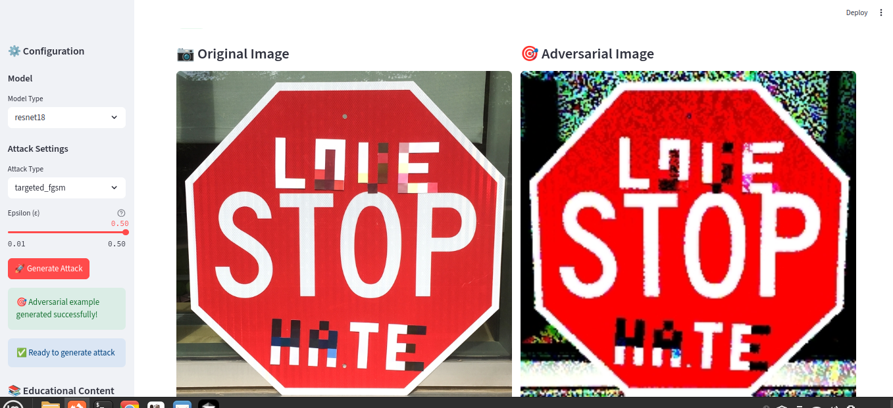

# Adversarial Comparator 🔬

[](https://creativecommons.org/licenses/by-nc-sa/4.0/)
[](https://www.python.org/downloads/)
[](https://streamlit.io/)
[](https://github.com/ninomirabile/adversarialComparator/actions)
[](https://github.com/ninomirabile/adversarialComparator/actions)
[](https://github.com/ninomirabile/adversarialComparator)
[](https://github.com/ninomirabile/adversarialComparator)
[](https://github.com/ninomirabile/adversarialComparator)
[](https://github.com/ninomirabile/adversarialComparator)
[](https://github.com/ninomirabile/adversarialComparator)
[](https://github.com/ninomirabile/adversarialComparator)
[](https://github.com/ninomirabile/adversarialComparator/issues)

> **Interactive web application for demonstrating adversarial attacks on image classification models**

An educational tool that allows users to upload images, visualize AI model predictions, and apply adversarial attacks to see how predictions change. Perfect for understanding AI robustness and security vulnerabilities.



## 🎓 Educational Project - First Step

**This is an educational project representing the first step in understanding adversarial attacks on AI systems.**

### 📚 Project Scope
This project is designed as a **learning foundation** and demonstrates:
- Basic concepts of adversarial machine learning
- Simple attack implementations (FGSM, PGD, DeepFool)
- Visual comparison of original vs. adversarial images
- Educational value for AI security awareness

### 🚀 Development Potential
While this is a **proof-of-concept** with limited capabilities, it provides a solid foundation for:
- **Further development** with more powerful models
- **Advanced attack algorithms** (AutoAttack, C&W, etc.)
- **GPU acceleration** for faster processing
- **Real-time video processing** capabilities
- **Custom model integration**

### ⚠️ Current Limitations
- **Model Power**: Uses lightweight models suitable for educational purposes
- **Processing Speed**: CPU-only inference (suitable for learning)
- **Attack Sophistication**: Basic attack implementations
- **Computational Requirements**: Designed for standard hardware

### 🎯 For Developers & Researchers
This project serves as a **starting point** for those interested in:
- **Building upon** the existing foundation
- **Experimenting** with different attack strategies
- **Learning** adversarial machine learning concepts
- **Contributing** to AI security education

**The codebase is ready for extension and improvement by anyone interested in advancing AI security research and education.**

## ⚠️ Educational Disclaimer

**IMPORTANT: This project is for EDUCATIONAL and RESEARCH purposes ONLY.**

### 🎓 Educational Purpose
This tool is designed to:
- **Educate** about AI vulnerabilities and robustness
- **Demonstrate** how adversarial attacks work in controlled environments
- **Research** AI security and defense mechanisms
- **Raise awareness** about the importance of robust AI systems

### 🚫 Not for Malicious Use
This project is **NOT intended** for:
- **Malicious attacks** on real-world systems
- **Harmful activities** or criminal purposes
- **Exploitation** of AI vulnerabilities in production systems
- **Any activities** that could cause harm or damage

### 🛡️ Responsible Usage
By using this tool, you agree to:
- **Use it only for educational and research purposes**
- **Respect ethical guidelines** and responsible AI practices
- **Not attempt to harm** any real-world systems or applications
- **Contribute positively** to AI security research and education

### 📚 Academic Context
This project is inspired by academic research on adversarial machine learning and is intended to support:
- **Academic research** in AI security
- **Educational programs** in machine learning
- **Responsible AI development** practices
- **Security awareness** in AI applications

**The authors and contributors are not responsible for any misuse of this tool.**

## 🎯 Project Overview

**Author**: Antonino Mirabile  
**License**: Creative Commons BY-NC-SA 4.0 (non-commercial, share alike)  
**Inspiration**: This project is inspired by the thesis "Attacchi adversarial ai dispositivi di visione basati su AI per il controllo dei veicoli a guida autonoma" (Adversarial Attacks on AI-based Vision Devices for Autonomous Vehicle Control)

## ✨ Features

### 🚀 Core Features
- **Image Upload & Processing**: Support for JPG, PNG, WebP formats
- **Real-time AI Inference**: Instant classification with confidence scores
- **Adversarial Attack Generation**: Multiple attack algorithms (FGSM, PGD, DeepFool)
- **Visual Comparison**: Side-by-side display of original vs. adversarial images
- **Prediction Analysis**: Detailed confidence changes across classes
- **Educational Content**: Built-in explanations of attacks and implications

### 🎓 Educational Value
- **Interactive Learning**: Hands-on experience with adversarial attacks
- **Visual Demonstrations**: Clear before/after comparisons
- **Parameter Control**: Adjustable attack strength and parameters
- **Real-world Context**: Understanding AI vulnerabilities in safety-critical systems

## 🏗️ Architecture

```
┌─────────────────┐    ┌─────────────────┐    ┌─────────────────┐
│   Frontend      │    │   Backend       │    │   ML Pipeline   │
│   (Streamlit)   │◄──►│   (Python)      │◄──►│   (PyTorch)     │
└─────────────────┘    └─────────────────┘    └─────────────────┘
         │                       │                       │
         ▼                       ▼                       ▼
┌─────────────────┐    ┌─────────────────┐    ┌─────────────────┐
│   User Input    │    │   Image Proc    │    │   Model Load    │
│   (File Upload) │    │   (Validation)  │    │   (Caching)     │
└─────────────────┘    └─────────────────┘    └─────────────────┘
```

## 🚀 Progressive Development

### Phase 1 - Ultra-Lightweight (Current)
- **Model**: ResNet18 quantizzato (INT8) o MobileNet
- **Inference**: CPU-only, single image processing
- **Attacks**: FGSM only (fastest attack)
- **UI**: Basic Streamlit interface
- **Target**: Proof of concept, basic functionality

### Phase 2 - Standard
- **Model**: Full ResNet18 or ResNet50
- **Inference**: CPU optimized, optional GPU acceleration
- **Attacks**: FGSM, PGD, DeepFool
- **UI**: Enhanced visualizations and comparisons
- **Target**: Educational tool with multiple attack types

### Phase 3 - Full-Featured
- **Model**: Multiple model options, custom model support
- **Inference**: GPU acceleration, batch processing
- **Attacks**: Complete attack library (AutoAttack, C&W, etc.)
- **UI**: Advanced analytics, video support (selected frames)
- **Target**: Research-grade tool

## 🛠️ Technology Stack

### Backend & Core ML
- **Python 3.8+**: Primary development language
- **PyTorch 2.0+**: Deep learning framework
- **Torchvision**: Computer vision utilities
- **torchattacks**: Adversarial attack implementations
- **OpenCV**: Image processing and manipulation
- **PIL/Pillow**: Image handling and format support

### Frontend & UI
- **Streamlit**: Primary web interface
- **Plotly/Matplotlib**: Visualization and plotting
- **HTML/CSS**: Custom styling

### Models & Data
- **Primary Model**: Pretrained ResNet18 on ImageNet (1000 classes)
- **Alternative Model**: Custom-trained GTSRB (German Traffic Sign Recognition) - May be included in Phase 2 for traffic-specific attack demos
- **Model Format**: ONNX for deployment optimization (optional)

## 📦 Installation

### Prerequisites
- Python 3.8 or higher
- 4GB+ RAM (2GB for application + 2GB for system)
- 1GB free disk space

### Quick Start

1. **Clone the repository**
   ```bash
   git clone https://github.com/ninomirabile/adversarialComparator.git
   cd adversarialComparator
   ```

2. **Create virtual environment**
   ```bash
   python -m venv venv
   source venv/bin/activate  # On Windows: venv\Scripts\activate
   ```

3. **Install dependencies**
   ```bash
   pip install -r requirements.txt
   ```

4. **Run the application**
   ```bash
   streamlit run app.py
   ```

5. **Open your browser**
   Navigate to `http://localhost:8501`

## 🎮 Usage

### Basic Workflow
1. **Upload Image**: Select and upload an image (JPG, PNG, WebP)
2. **View Original Prediction**: See the AI model's classification with confidence
3. **Configure Attack**: Choose attack type and adjust parameters
4. **Generate Adversarial**: Create perturbed version of your image
5. **Compare Results**: Side-by-side visualization with prediction changes
6. **Learn**: Read educational content about the attack and implications

### Supported Attacks
- **FGSM (Fast Gradient Sign Method)**: Fast, single-step attack
- **PGD (Projected Gradient Descent)**: Iterative, more effective attack
- **DeepFool**: Minimal perturbation attack

### Parameters
- **Epsilon (ε)**: Attack strength (0.01 - 0.3 recommended)
- **Iterations**: Number of attack steps (for PGD)
- **Step Size**: Learning rate for iterative attacks

## 🔧 Development

### Project Structure
```
adversarialComparator/
├── app.py                 # Main Streamlit application
├── src/
│   ├── models/           # Model loading and inference
│   ├── attacks/          # Adversarial attack implementations
│   ├── utils/            # Utility functions
│   └── config/           # Configuration files
├── docs/                 # Documentation
├── tests/                # Test files
├── requirements.txt      # Python dependencies
└── README.md            # This file
```

### Running Tests
```bash
python -m pytest tests/
```

### Code Quality
```bash
# Linting
flake8 src/
# Type checking
mypy src/
```

## 📊 Performance

### System Requirements
- **Minimum**: 4GB RAM, Dual-core CPU
- **Recommended**: 8GB RAM, Quad-core CPU
- **Optimal**: 16GB RAM, GPU acceleration

### Response Times
- **Image Upload**: < 1s for files up to 5MB
- **Model Loading**: < 2s (with caching)
- **Inference**: < 500ms for single image
- **Attack Generation**: < 3s for standard attacks
- **UI Responsiveness**: < 100ms for interactions

## 🔒 Security & Privacy

### Educational Purpose
- **Research Only**: This tool is for educational and research purposes
- **No Malicious Use**: Do not use for harmful purposes
- **Understanding Vulnerabilities**: Learn to improve AI robustness
- **Detailed Guidelines**: See [DISCLAIMER.md](DISCLAIMER.md) for comprehensive usage guidelines

### Application Security
- **Input Validation**: Strict file type and size limits
- **No Persistence**: Uploaded files not stored permanently
- **Sandboxed Execution**: Isolated model inference environment
- **Rate Limiting**: Prevent abuse and resource exhaustion

### AI Safety
- **Demo Only**: No real-world model manipulation
- **Controlled Environment**: Limited attack parameters
- **Educational Context**: Clear disclaimers about research purposes
- **Ethical Guidelines**: Responsible AI usage principles

### Data Privacy
- **No Data Collection**: User images not logged or stored
- **Local Processing**: All computation done in user session
- **Clear Policies**: Transparent data handling practices

## 🤝 Contributing

We welcome contributions! Please see our [Contributing Guidelines](docs/CONTRIBUTING.md) for details.

### Development Setup
1. Fork the repository
2. Create a feature branch
3. Make your changes
4. Add tests
5. Submit a pull request

## 📄 License

This project is licensed under the **Creative Commons Attribution-NonCommercial-ShareAlike 4.0 International License** (CC BY-NC-SA 4.0).

### **🔒 Non-Commercial Use Only**
- **Educational Purpose**: This project is designed for learning and research
- **Academic Use**: Available for educational institutions and research
- **Personal Use**: Individuals can use for personal learning
- **No Commercial Use**: Cannot be used for commercial purposes or profit

### **📋 License Terms**
- **Attribution**: You must give appropriate credit to Antonino Mirabile
- **NonCommercial**: You may NOT use for commercial purposes
- **ShareAlike**: If you remix, transform, or build upon the material, you must distribute your contributions under the same license

### **🎓 Permitted Uses**
- ✅ Educational demonstrations
- ✅ Academic research
- ✅ Personal learning projects
- ✅ Non-profit educational content
- ✅ Student projects and assignments

### **🚫 Prohibited Uses**
- ❌ Commercial applications
- ❌ Commercial software integration
- ❌ Paid services or products
- ❌ Commercial training materials
- ❌ Any use for profit

See [LICENSE.md](LICENSE.md) for full details and legal terms.

## 📚 Documentation

- [User Guide](docs/USER_GUIDE.md) - Detailed usage instructions
- [Developer Guide](docs/DEVELOPER_GUIDE.md) - Development setup and guidelines
- [Architecture](docs/ARCHITECTURE.md) - System design and components
- [CI/CD Guide](docs/CI_CD_GUIDE.md) - Continuous Integration and Deployment

## 🚀 CI/CD Pipeline

This project uses GitHub Actions for automated testing, security scanning, and quality assurance:

### **🔄 Automated Checks**
- **Multi-Python Testing**: Python 3.8, 3.9, 3.10 compatibility
- **Code Quality**: Flake8, Black, isort, MyPy validation
- **Security Scanning**: Bandit, Safety, pip-audit vulnerability checks
- **Documentation**: Markdown validation and link checking
- **Performance**: Model loading time and memory usage monitoring

### **📊 Quality Gates**
- **Test Coverage**: Minimum coverage requirements
- **Code Style**: Automated formatting and linting
- **Security**: Vulnerability scanning and dependency checks
- **Documentation**: Required files and format validation

### **🎯 Benefits**
- **Educational Value**: Demonstrates professional development practices
- **Quality Assurance**: Ensures code reliability and security
- **Easy Contribution**: Automated checks for pull requests
- **Continuous Improvement**: Regular monitoring and feedback

See [CI/CD Guide](docs/CI_CD_GUIDE.md) for detailed information about the pipeline.

## 📊 Project Status & Metrics

### 🚀 Development Status
[](https://github.com/ninomirabile/adversarialComparator/actions)

### 📈 Community & Engagement
[](https://github.com/ninomirabile/adversarialComparator/issues)
[](https://github.com/ninomirabile/adversarialComparator/pulls)
[](https://github.com/ninomirabile/adversarialComparator/stargazers)

### 📊 Code Quality & Coverage
[](https://codecov.io/gh/ninomirabile/adversarialComparator)
[](https://github.com/ninomirabile/adversarialComparator)
[](https://github.com/ninomirabile/adversarialComparator)
[](https://github.com/ninomirabile/adversarialComparator/commits/main)

### 🔒 Security & Maintenance
[](https://github.com/ninomirabile/adversarialComparator/security)
[](https://github.com/ninomirabile/adversarialComparator)

### 🎓 Educational Focus
[](https://github.com/ninomirabile/adversarialComparator)
[](https://github.com/ninomirabile/adversarialComparator)
[](https://github.com/ninomirabile/adversarialComparator)

## 🙏 Acknowledgments

- **PyTorch Team**: For the excellent deep learning framework
- **Streamlit Team**: For the amazing web app framework
- **torchattacks Library**: For adversarial attack implementations
- **Academic Community**: For research on adversarial machine learning

---

**Made with ❤️ by Antonino Mirabile for AI Education and Security Awareness**
